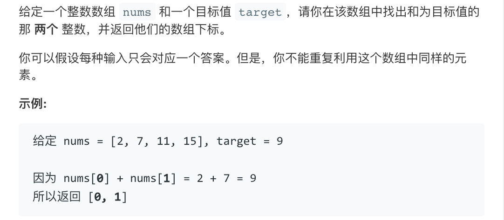

# 1. 两数之和（Two Sum）

## 描述



## 解法分析

### 解法1

求解的关键则是 $k = target - nums[i]$, k 是否在数组 $nums$ 中，且 k 的索引不等于 i。

先将数组 $nums$ 转化为字典 $ref$，其中字典的 key 为数组 $nums$ 存储的数据， 字典的 value 为数据对应在 $nums$ 中的 index。这样只需要遍历字典 $ref$的 key，计算 $searchback = target - some_key$， 并判断 $searchback$ 是否是不等于 some_key 的 key。

空间复杂度： 借用了字典来存储 nums， *O(N)*
平均时间复杂度：*O(N/2)*
最坏时间复杂度： *O(N)* 因为有可能遍历到字典最后两个数据才能得出结果。

```Python
# 1 two sum 两数之和

__author__ = "Yang Xuan (jumpthepig@gmail.com)"


def twoSum(nums, target):

    # Change list into dictionary.
    # dictionary_keys are values of list nums
    # dictionary_value are indexes of list nums
    ref = {value: index for (index, value) in enumerate(nums)}

    for index, value in enumerate(nums):
        searchback = ref.get(target - value, None)
        if searchback and searchback != index:
            return [index, searchback]
        continue


args = ([2, 7, 11, 15], 9)
assert twoSum(*args) == [0, 1]
```

```c++
vector<int> twoSum(vector<int>& nums, int target) {
    std::map<int,int> dictionary;
    std::vector<int> result;
    for (int i = 0; i < nums.size(); ++i) {
        dictionary[nums[i]] = i;
    }
    
    for (int j = 0; j < nums.size(); ++j){
        int tmp = target - nums[j];
        std::map<int, int>::iterator tmp_ptr = dictionary.find(tmp);
        if (tmp_ptr != dictionary.end() && tmp_ptr->second != j) {
            result.push_back(j);
            result.push_back(tmp_ptr->second);
            break;
        }
    }
    return result;
}
```


### 解法2 暴力法

时间复杂度 $O(N^2)$

```c++
vector<int> twoSum(vector<int>& nums, int target) {
    vector<int> result;
    for (int i = 0; i < nums.size(); ++i) {
        for (int j = i + 1; j < nums.size(); ++j) {
            if ( nums[i] + nums[j] == target ) {
                result.push_back(i);
                result.push_back(j);
                return result;
            }
        }
    }
    return result;
}
```


